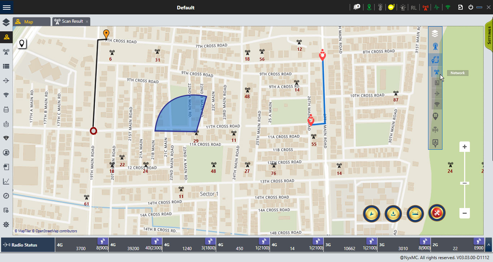

# OsmWpflite
Open source map library build in the C3 for the WPF .Net Project

##  When to use this
If you want to build a map layer inside you native C# wpf application

## Usage
Use it as library by import the project and configuring the gradle

## Components

Tile Map Service: XYZ System

